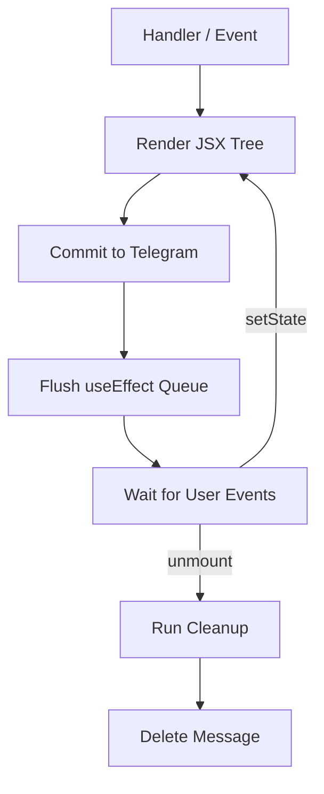
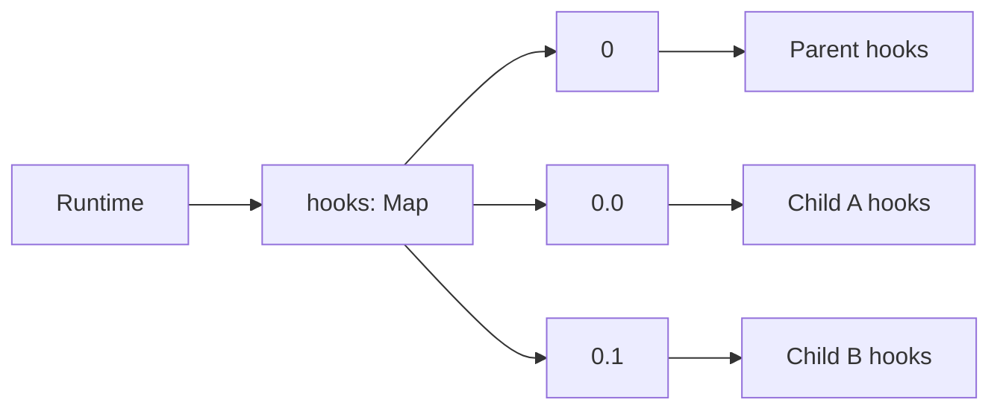
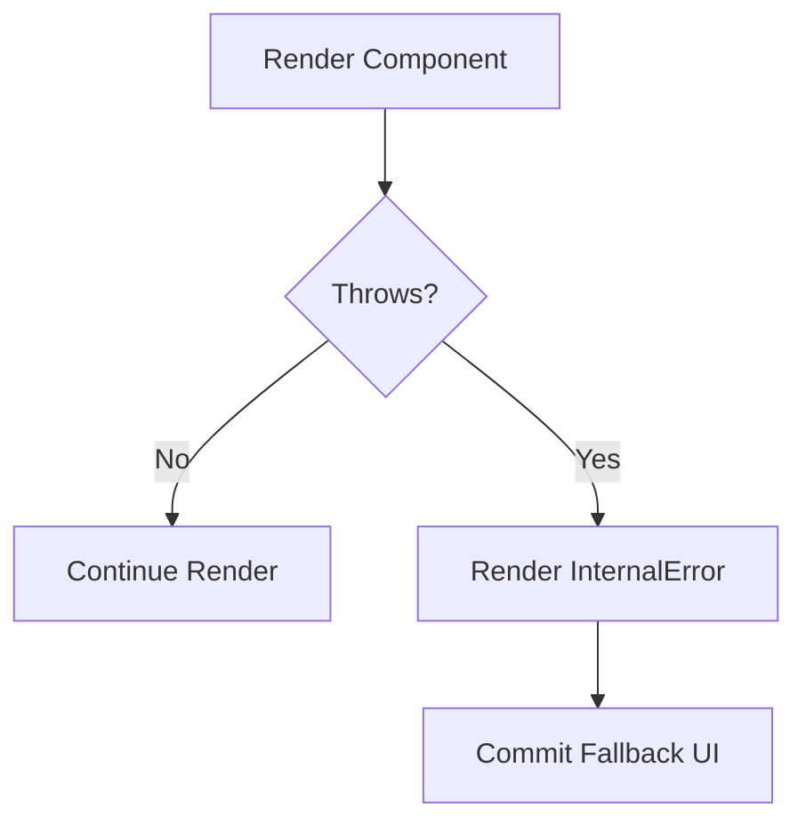
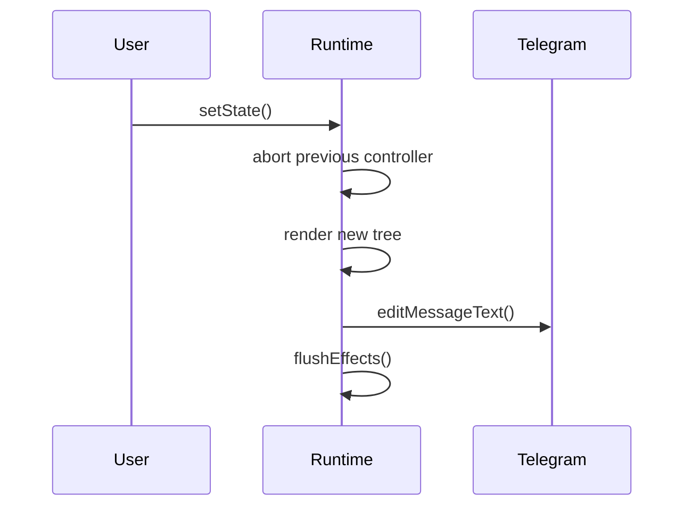
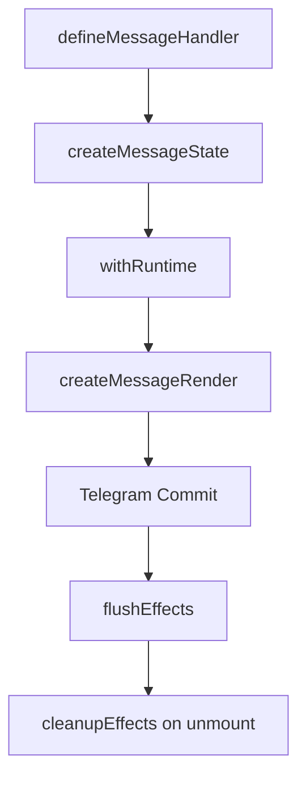

# @xlsft/grammy-reactive

> React-like stateful library for **grammY** with JSX, hooks, lifecycle, effects, and component error boundaries.

---

# ✨ Features

- ⚛️ JSX component system
- 🪝 React-like hooks API
- 🔁 Stateful rerendering
- 🧠 Persistent component-local hook storage
- 🧹 `useEffect` with cleanup support
- 💥 Error boundaries for root + nested components
- ⛔ Abortable rerenders via `AbortController`
- 🧩 Async component support
- 📦 Component path–scoped state isolation
- 🤖 Deep access to `grammY` context via runtime hooks

---

# 🚀 Quick Start

## Installation

```bash
# Bun
bun add @xlsft/grammy-reactive

# npm
npm install @xlsft/grammy-reactive

# pnpm
pnpm add @xlsft/grammy-reactive

# yarn
yarn add @xlsft/grammy-reactive
```

Add JSX runtime to `tsconfig.json`

```json
{
    "compilerOptions": {
        "jsxImportSource": "@xlsft/grammy-reactive/jsx",
        "jsx": "react-jsx",
    },
}

```

---

## Basic Message Component

```tsx
import { Bot, Context } from "grammy";
import { defineMessageHandler, useState, reactive, type ReactiveFlavor } from "@xlsft/grammy-reactive";

const bot = new Bot<ReactiveFlavor<Context>>(process.env.TG_TOKEN!);
bot.use(reactive());

const startHandler = defineMessageHandler(async () => {
    const [count, setCount] = useState(0);

    return (
        <>
            <h>Counter</h>
            <blockquote>
                Value: <b>{count}</b>
            </blockquote>
            <button onClick={() => setCount(c => c + 1)}>
                Increment
            </button>
        </>
    );
});

bot.command("start", startHandler);
```
---
# 📔 Full documentation 

WIP

---

# 🧠 Core Mental Model

Every message handler creates a **persistent message runtime instance**.

This runtime stores:

- current Telegram message state
- hook values
- effect queue
- cleanup callbacks
- component tree path
- abort controller
- grammY context

Each rerender reuses the same runtime.

---

# 🪝 Hooks API

The framework ships with a familiar React-like hooks layer:

- `useState` → local reactive state
- `useMemo` → memoized computed values
- `useCallback` → stable callback references
- `useReducer` → complex state transitions
- `useEffect` → post-commit side effects + cleanup

...etc

### All hooks are:

- component-path scoped
- persistent across rerenders
- safe inside async components
- automatically restored by render order

---


# 🔘 Inline Buttons

Inline buttons are a **first-class reactive UI primitive**.

They behave like component event handlers and automatically participate in the lifecycle runtime.

```tsx
<button color="primary" onClick={() => setCount(c => c + 1)}>
    Increment
</button>
```
```tsx
<button variant="copy" value="Copy this text!">
    Copy what text?
</button>
```
```tsx
<button variant="url" url="https://google.com">
    Go to google
</button>
```


# 🧩 Stateful Component Example

```tsx
import {
    defineMessageHandler,
    useEffect,
    useState,
    useContext,
} from "@xlsft/grammy-reactive";

export default defineMessageHandler(async () => {
    const [seconds, setSeconds] = useState(0);
    const ctx = useContext();

    useEffect(() => {
        const interval = setInterval(() => {
            setSeconds(s => s + 1);
        }, 1000);

        return () => clearInterval(interval);
    }, []);

    return <b>Running for {seconds}s</b>;
});
```

---

# 🔄 Lifecycle Model

The framework uses a **render → commit → effects** lifecycle.



---

# 🧠 Hook Storage Architecture

Hooks are stored by **component path key**.



This guarantees:

- sibling isolation
- nested component stability
- deterministic hook ordering
- subtree-safe rerenders

---

# 🧬 State Management Principles

## 1) Component Path Isolation
Each component subtree owns its own hook array.

This prevents collisions between:

```tsx
<A />
<B />
```

Both may safely use:

```tsx
useState()
```

without shared state.

---

## 2) Functional Updates Preferred
Always prefer:

```tsx
setCount(prev => prev + 1)
```

over:

```tsx
setCount(count + 1)
```

This avoids stale closures in async effects.

---

## 3) Effects Are Commit-Phase Only
`useEffect` runs **after successful Telegram message update**.

This guarantees UI consistency.

---

# 💥 Error Boundaries

The framework automatically catches:

- root handler exceptions
- nested component exceptions
- rerender errors
- effect cleanup errors
- event handler errors

Fallback UI renders `InternalError` safely.



---

# ⛔ Abort + Rerender Semantics

Every message runtime owns its own `AbortController`.

Before rerender:

1. previous controller is aborted
2. new controller is created
3. stale async updates are cancelled



---

# 📐 Best Practices

## ✅ Prefer split effects

```tsx
useEffect(startInterval, []);
useEffect(syncReaction, [seconds]);
```

instead of mixing unrelated side effects.

---

## ✅ Use reducer for flows
Use `useReducer` for:

- wizards
- menus
- calculators
- async status machines
- pagination

---

## ✅ Memoize callbacks for child props

```tsx
const onSave = useCallback(() => save(id), [id]);
```

---

# 🏗️ Architecture Summary



---

# ❤️ Philosophy

The goal is simple:

> Bring **React-like declarative stateful UI architecture** into Telegram bots without losing grammY power.

This library treats a Telegram message as a **live reactive UI surface**.

State, effects, rerenders, and cleanup behave like a real component runtime.

---

# 📄 License

MIT
